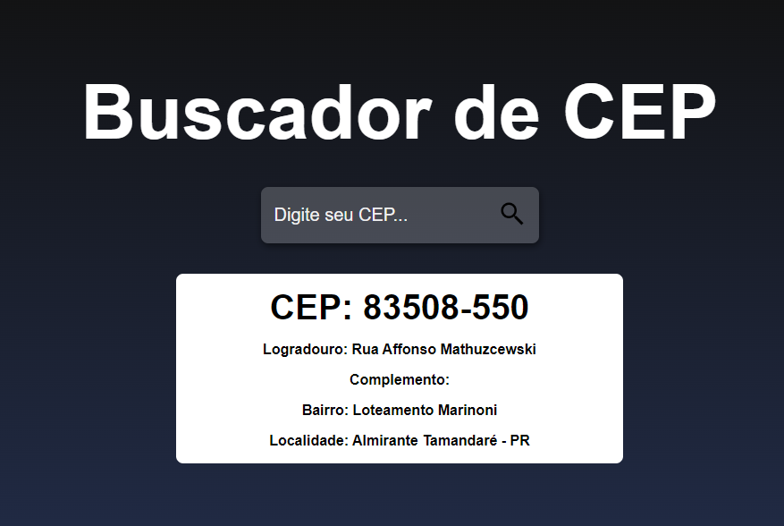

# Buscador-cep

<h5>Detalhes a se destacar no projeto</h5>

<ul>
     <li>O Projeto tem o foco em Práticar Display Flex e Responsividade ⌨️</li>
     <li>Nesse projeto foi utilizado useState para alteração dos inputs de busca e valores</li>
     <li>Foi utilizado async e await para a espera da requisição dos CEPs</li>
     <li>Foi utilizado a API https://viacep.com.br/ws para a busca de CEPs</li>
</ul>
 

